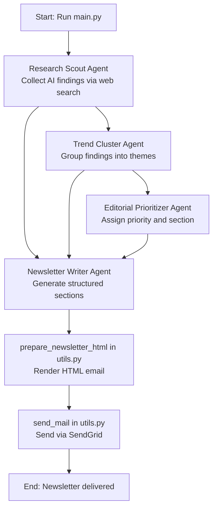

# AI Insights Newsletter

A multi-agent pipeline that researches AI updates, clusters trends, prioritizes editorial focus, writes newsletter content, converts it into styled HTML, and sends it via SendGrid.

## What It Does

The workflow runs four specialized agents in sequence:

1. `research_scout_agent.py`  
   Collects high-signal AI updates using web search.
2. `trend_cluster_agent.py`  
   Groups findings into meaningful theme clusters.
3. `editorial_prioritizer_agent.py`  
   Scores and prioritizes clustered topics for newsletter relevance.
4. `newsletter_writer_agent.py`  
   Produces structured newsletter sections (`headline`, `body`, `source_link`).

Finally, `utils.py`:
- Renders sections into a reusable HTML email template
- Sends the final newsletter via SendGrid

The orchestration entrypoint is `main.py`.

## Agentic Workflow Diagram



## Project Structure

```text
ayan-ai-insights-newsletter/
├── main.py
├── utils.py
├── research_scout_agent.py
├── trend_cluster_agent.py
├── editorial_prioritizer_agent.py
├── newsletter_writer_agent.py
├── system_prompts/
│   ├── research_agent_prompt.txt
│   ├── trend_cluster_agent_prompt.txt
│   ├── editorial_prioritizer_prompt.txt
│   └── newsletter_writer_prompt.txt
├── sample_newsletter.html
└── experiments_email_designer/
    ├── Readme.md
    ├── email_designer_agent.py
    ├── email_designer_prompt.txt
    └── email_designer_prompt_2.txt
```

## Requirements

- Python 3.10+
- `uv` installed ([installation guide](https://docs.astral.sh/uv/getting-started/installation/))
- OpenAI Agents SDK-compatible dependencies
- SendGrid account + API key

## Setup with uv

```bash
uv venv
source .venv/bin/activate
uv pip install openai-agents python-dotenv sendgrid
```

## Environment Variables

Create a `.env` file in this directory with:

```env
OPENAI_API_KEY=your_openai_api_key
SENDGRID_API_KEY=your_sendgrid_api_key
SENDGRID_FROM_EMAIL=verified_sender@example.com
SENDGRID_TO_EMAIL=recipient@example.com
```

Notes:
- `SENDGRID_FROM_EMAIL` must be a verified sender in SendGrid.
- The script uses `load_dotenv(override=True)`, so local `.env` values are loaded at runtime.

## How to Run

From this directory (without manually activating the virtualenv):

```bash
uv run main.py
```

Expected runtime flow:
- Starts the agentic workflow trace
- Runs research → clustering → prioritization → writing
- Builds final HTML newsletter
- Sends email through SendGrid

## Output Format

The generated newsletter is modeled as:
- `sections[]`
  - `headline`
  - `body`
  - `source_link`

This is transformed into a styled HTML template before delivery.

## Prompt Customization

You can tune editorial behavior by editing files in `system_prompts/`:
- Story selection criteria
- Prioritization style
- Section tone and formatting
- Writing constraints

## Troubleshooting

- **Import errors**: Run `uv pip install openai-agents python-dotenv sendgrid` again inside the project environment.
- **No email sent**: Verify `SENDGRID_API_KEY`, sender verification, and recipient email.
- **Weak results**: Tighten prompt instructions in `system_prompts/` for clearer constraints.

## Notes

- `experiments_email_designer/` contains earlier design experiments and context.
- The current production path uses the static HTML assembly in `utils.py`.
