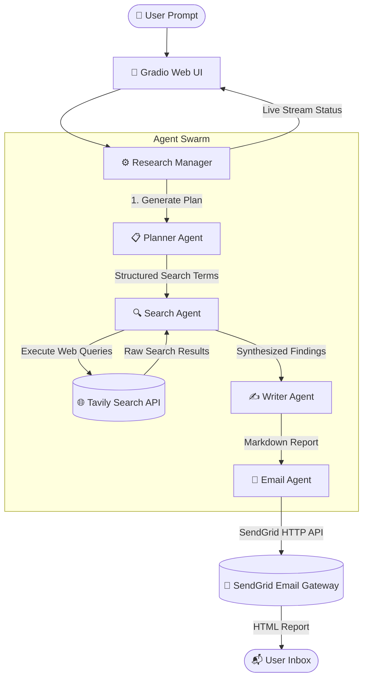

# 🧠 Deep Research AI

<div align="center">


An autonomous multi-agent deep research platform engineered by **Bhupesh Danewa**. It performs web-wide investigations, synthesizes structured technical reports, and automatically delivers formatted HTML research reports directly to user inboxes.

<p align="center">
  <b>✨ Created & Maintained by <a href="https://github.com/bhupeshdanewa07">Bhupesh Danewa</a> ✨</b>
</p>

[🚀 **Launch Live App**](https://deep-research-aiagent.onrender.com/) • [✨ Features](#-features) • [🏗️ System Architecture](#%EF%B8%8F-system-architecture) • [⚡ Quick Start](#-quick-start)

---

</div>

## 🌟 Overview

**Deep Research AI** automates complex web research workflows by leveraging a coordinated swarm of specialized AI agents. Conceived and built by **Bhupesh Danewa**, the system plans multi-angle search queries, gathers real-time web intelligence, synthesizes long-form comprehensive markdown reports, and sends polished HTML emails to recipients.

* 🌐 **Live Web App:** [https://deep-research-aiagent.onrender.com/](https://deep-research-aiagent.onrender.com/)

---

## ✨ Features

- 🎯 **Autonomous Search Planning:** Deconstructs complex user prompts into targeted, multi-perspective search queries.
- 🌐 **Real-time Web Search:** Integrates with the Tavily Search API for up-to-the-minute web intelligence gathering.
- 📑 **Comprehensive Report Generation:** Synthesizes exhaustive reports complete with executive summaries, detailed analysis, and follow-up research topics.
- 📧 **Direct Inbox Delivery:** Formats and dispatches reports as responsive HTML emails using SendGrid's REST API.
- ⚡ **Real-time Streaming UI:** Custom Gradio web interface designed by Bhupesh Danewa, featuring dynamic execution updates.
- 🛡️ **Production-Ready & Cloud Deployable:** Configured for seamless 24/7 deployment on Render free/paid tiers.

---

## 🏗️ System Architecture

The application is built on an asynchronous multi-agent architecture powered by **OpenAI Agents SDK** and **Google Gemini**:



### 🤖 Agent Roles Breakdown

1. **Planner Agent:** Analyzes the prompt and generates `N` distinct, high-signal search terms using structured Pydantic schemas.
2. **Search Agent:** Iterates through planned searches, executes Tavily web calls, and condenses findings into concise summaries.
3. **Writer Agent:** Assembles collected research into a multi-page detailed markdown document with structured metadata.
4. **Email Agent:** Converts markdown reports into clean HTML documents and triggers email delivery via SendGrid.

---

## 🛠️ Tech Stack

- **Core Framework:** Python 3.11+
- **Agent Framework:** `openai-agents` (OpenAI Agents SDK)
- **LLM Engine:** Google Gemini 3.1 Flash Lite (via OpenAI compatibility endpoint)
- **Search Provider:** Tavily Search API
- **Email Service:** SendGrid REST API
- **Web UI:** Gradio
- **Deployment Platform:** Render

---

## ⚙️ Environment Variables

Create a `.env` file in the root directory or set these environment variables in your deployment platform:

| Key | Description | Required |
| :--- | :--- | :--- |
| `SENDGRID_API_KEY` | SendGrid API key for dispatching emails | **Yes** |
| `EMAIL_ADDRESS` | Verified sender address (`bhupeshdanewaa@gmail.com`) | **Yes** |
| `GOOGLE_API_KEY` | Gemini API key for running LLM agents | **Yes** |
| `TAVILY_API_KEY` | Tavily Search API key for web research | **Yes** |
| `GEMINI_MODEL_NAME` | Model identifier (Default: `gemini-3.1-flash-lite`) | Optional |
| `HOW_MANY_SEARCHES` | Number of search queries to plan (Default: `5`) | Optional |
| `USE_EMAIL` | Enable/disable email sending (Default: `true`) | Optional |

---

## ⚡ Quick Start

### 1. Clone the Repository
```bash
git clone https://github.com/bhupeshdanewa07/agents.git
cd agents/2_openai/deep_research
```

### 2. Install Dependencies
```bash
pip install -r requirements.txt
```

### 3. Set Up Environment Variables
Create a `.env` file and add your API keys:
```env
SENDGRID_API_KEY=SG.your_key_here
EMAIL_ADDRESS=bhupeshdanewaa@gmail.com
GOOGLE_API_KEY=your_gemini_key
TAVILY_API_KEY=your_tavily_key
```

### 4. Run Locally
```bash
python app.py
```
Open your browser at `http://127.0.0.1:7860` to access the interface.

---

## 🚀 Cloud Deployment (Render)

1. Connect your repository to **[Render](https://dashboard.render.com)**.
2. Select **Web Service** and use the following settings:
   - **Runtime:** `Python 3`
   - **Build Command:** `pip install -r requirements.txt`
   - **Start Command:** `python app.py`
3. Add your Environment Variables under **Service Settings -> Environment**.
4. Deploy! Live demo will be available at your Render URL.

---

## 👨‍💻 Created & Developed By

<div align="center">

### **Bhupesh Danewa**

> *"Building autonomous AI agents that transform raw web information into actionable intelligence."*

[](https://github.com/bhupeshdanewa07)
[](https://deep-research-aiagent.onrender.com/)

</div>

---

<div align="center">
  <sub>Designed & Engineered with ❤️ by <b>Bhupesh Danewa</b> • Powered by OpenAI Agents SDK & Google Gemini.</sub>
</div>
