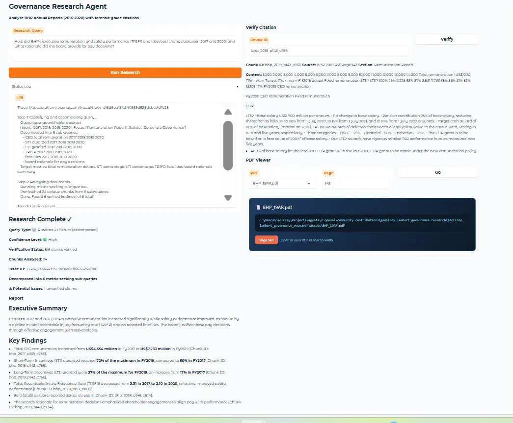
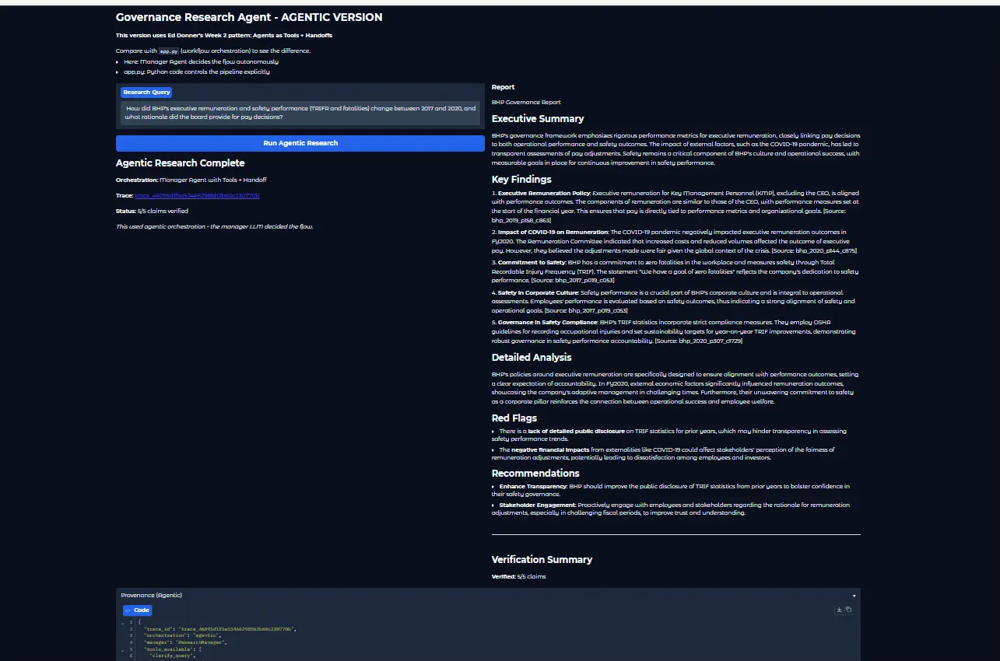

# 🏛️ Governance Research Agent

**Forensic-grade governance research with citation-enforced verification**

A multi-agent system that analyses ASX annual reports and produces verified, citation-backed research outputs suitable for legal and regulatory use cases.

---

## Introduction

This project was built as part of [Ed Donner's AI Agents Course](https://github.com/ed-donner/agents) — specifically the **Week 2 Deep Research Agent** assignment. The goal was to apply the agentic patterns taught in the course to a real-world domain where accuracy, traceability, and verification are critical.

As a lawyer and computer forensic specialist with 25 years of experience, I chose corporate governance research as the domain. Governance analysts spend significant time manually searching annual reports to answer questions like "How did executive compensation change over the past 5 years?" or "What was the board's stated rationale for remuneration policy changes?" These queries require not just answers, but **defensible, citation-backed evidence**.

This project builds on foundations from Ed's other courses in the series:
- **RAG pipelines** from the LLM Engineering course
- **Workflow automation** patterns from the n8n course
- **Agentic orchestration** from this Agents course

The result is two working implementations that demonstrate different orchestration patterns, **both intended for production use** depending on the specific requirements of the research task.

---

## Learning Philosophy & Approach

### Starting with the Business Problem

Rather than building a demo to satisfy assignment criteria, I started with a real business need:

> **"I need a system that can analyse 5 years of ASX annual reports and answer governance research questions with citation-grade accuracy — every claim traceable to source, suitable for legal and regulatory use."**

This framing forced architectural decisions that a synthetic example wouldn't surface: What happens when chunks don't have page numbers? How do you handle a query about fatalities where paraphrasing changes meaning? What verification standard is "good enough" for professional use?

### Learn Broadly, Build Broadly, Compare

My approach was to:

1. **Learn the patterns** — Ed's courses provided the foundation: RAG pipelines from the LLM Engineering course, workflow automation from the n8n course, and agentic patterns from this Agents course
2. **Build multiple implementations** — Rather than committing to one approach, I built both:
   - `app.py` — Workflow orchestration (Python controls flow)
   - `app_agentic.py` — Agentic orchestration (LLM controls flow via agents-as-tools + handoffs)
3. **Compare on real data** — Synthetic test data is "too kind" — it doesn't surface edge cases. Real BHP annual reports revealed issues like missing page metadata, inconsistent diversity disclosures across years, and sensitive claims requiring exact source language.

### Real Data, Real Problems

Using actual BHP annual reports (2016-2020) instead of synthetic data surfaced genuine challenges:

- **Data quality issues** — Some chunks lacked page numbers in metadata, crashing the pipeline
- **Terminology variation** — "Female directors" vs "women on board" vs "gender diversity" across years
- **Sensitive content** — Fatality reporting required exact source language, not paraphrased summaries
- **Sparse early data** — 2016 diversity disclosures less structured than 2020

These wouldn't appear in a curated demo dataset.

---

## Development Journey

I started with a **Jupyter notebook** to prototype the multi-agent pipeline, iterating on prompts and agent handoffs. Once the core logic was working, I converted it to a **standalone Gradio app** (`app.py`) for a more polished interface with PDF viewing and citation verification features.

After validating the workflow approach, I built a second implementation (`app_agentic.py`) using Ed's agents-as-tools and handoffs pattern to demonstrate understanding of both orchestration styles and enable direct comparison.

---

## Principles from Ed's Week 2 Tutorial

The following agentic patterns from Ed's course were applied:

| Principle | Implementation |
|-----------|----------------|
| **Agent specialisation** | Four distinct agents (Clarifier, Analyst, Writer, Verifier) each with focused responsibilities |
| **Tool use** | Agents equipped with search tools to query the document corpus |
| **Handoffs** | Sequential pipeline where each agent's output feeds the next |
| **Structured outputs** | Pydantic models for findings, reports, and verification results |
| **Tracing** | OpenAI platform tracing for debugging agent behaviour |
| **Guardrails** | Verification agent acts as a guardrail against hallucination |

---

## Architecture

### Multi-Agent Pipeline

```
┌─────────────┐     ┌──────────────┐     ┌────────────┐     ┌──────────────┐
│  Clarifier  │ ──▶ │   Analyst    │ ──▶ │   Writer   │ ──▶ │   Verifier   │
│   Agent     │     │    Agent     │     │   Agent    │     │    Agent     │
└─────────────┘     └──────────────┘     └────────────┘     └──────────────┘
      │                   │                    │                   │
      ▼                   ▼                    ▼                   ▼
  Classify Query      Search PDFs          Write Report       Check Citations
  Decompose if        Extract Findings     Add Citations       Verify Claims
  Abstract            with Chunk IDs       Synthesise          Flag Issues
```

1. **Clarifier** — Classifies query type (concrete, quantifiable_abstract, qualitative_abstract), identifies relevant years and document sections, decomposes abstract queries into metric-seeking sub-queries
2. **Analyst** — Searches PDF chunks using BM25, extracts findings with chunk IDs and page references
3. **Writer** — Synthesises findings into a structured report with inline citations
4. **Verifier** — Independently checks every claim against source chunks, flags potential hallucinations

### Key Innovation: Query Decomposition

A core challenge in governance research is that users ask **abstract questions** that don't map directly to searchable text:

> "How did board diversity change from 2016 to 2020?"

Without decomposition, the system retrieves vague narrative chunks about "commitment to diversity" and generates unverifiable claims like "diversity improved significantly."

**The solution:** The Clarifier agent detects abstract queries and decomposes them into concrete, metric-seeking sub-queries:

```
Original: "How did board diversity change from 2016 to 2020?"

Decomposed:
- "Board composition female directors 2016"
- "Board gender composition 2017"
- "Female directors percentage 2018"
- "Women on board 2019"
- "Board diversity metrics 2020"
```

This yields specific, verifiable findings like "Female directors increased from 2 of 11 (18%) in 2016 to 4 of 12 (33%) in 2020."

---

## Two Implementations: Workflow vs Agentic

**I intend to use both implementations in production**, selecting the appropriate approach based on the research requirements. Workflow for regulatory/legal work requiring reproducibility; agentic for exploratory research where flexibility is valuable.

### Workflow Orchestration (`app.py`)

```
User Query
    ↓
GovernanceResearchManager (Python class)
    │
    ├── await Runner.run(clarifier_agent, query)      # Step 1
    │         ↓ returns ClarifyingQuestions
    │
    ├── await Runner.run(analyst_agent, prompt)       # Step 2
    │         ↓ returns AnalystReport
    │
    ├── await Runner.run(writer_agent, prompt)        # Step 3
    │         ↓ returns ReportData
    │
    └── await Runner.run(verifier_agent, prompt)      # Step 4
              ↓ returns VerificationResult
    ↓
Final Output
```

**How it works:**
- Python code controls the flow
- Each step is deterministic — always runs in order
- You explicitly pass data between agents
- The "manager" is your Python class, not an LLM

### Agentic Orchestration (`app_agentic.py`)

```
User Query
    ↓
research_manager_agent (LLM Agent)
    │
    │ "I need to clarify this query first"
    ├──→ calls clarifier_agent.as_tool()    ← TOOL (control returns)
    │         ↓ returns clarification
    │
    │ "Now I need analysis on these years"
    ├──→ calls analyst_agent.as_tool()      ← TOOL (control returns)
    │         ↓ returns findings
    │
    │ "Time to write the report"
    ├──→ calls writer_agent.as_tool()       ← TOOL (control returns)
    │         ↓ returns draft report
    │
    │ "Handing off to verifier for final check"
    └──→ handoff to verifier_agent          ← HANDOFF (control transfers)
              ↓
         verifier_agent completes and returns
    ↓
Final Output
```

**How it works:**
- The manager is an LLM Agent that decides what to do
- Other agents are converted to tools via `.as_tool()`
- Manager calls tools and gets results back (control returns)
- Manager uses handoff to transfer control to verifier (control transfers, doesn't return)
- The LLM decides the order and whether to retry/skip steps

### Comparison Table

| Aspect | Workflow (`app.py`) | Agentic (`app_agentic.py`) |
|--------|---------------------|----------------------------|
| Orchestrator | Python class | LLM Agent |
| Flow control | You decide (deterministic) | LLM decides (autonomous) |
| Agent calls | `Runner.run(agent, ...)` | `agent.as_tool()` called by manager |
| Data passing | Explicit in your code | Manager decides what to pass |
| Handoffs | None (sequential calls) | Verifier gets handoff (control transfers) |
| Reliability | High (predictable) | Lower (LLM may vary) |
| Flexibility | Low (fixed pipeline) | High (can adapt/retry) |
| **Best for** | Legal/regulatory work | Exploratory research |

---

## Comparison: Same Query, Different Approaches

Query: *"How did BHP's executive remuneration and safety performance (TRIFR and fatalities) change between 2017 and 2020, and what rationale did the board provide for pay decisions?"*

### Workflow Output (`app.py`)



- **Decomposed into 6 metric-seeking sub-queries**
- **24 chunks analysed**
- **5/6 claims verified** with chunk-level citations
- **Specific metrics extracted:**
  - CEO remuneration: US$4.554m (FY2017) → US$7.733m (FY2019)
  - STI awarded: 50% (FY2017) → 72% (FY2019)
  - LTI granted: 17% → 37%
  - TRIFR: 3.31 (2017) → 2.10 (2020)
  - Zero fatalities reported across all years

### Agentic Output (`app_agentic.py`)



- **Manager LLM decided the research flow autonomously**
- **5/5 claims verified**
- **Thematic analysis produced:**
  - Executive remuneration policy aligned with performance
  - COVID-19 impact on FY2020 outcomes
  - Safety culture as corporate pillar
  - Red flags about disclosure transparency
  - Recommendations for stakeholder engagement

### Verdict

Both approaches have production value:

| Use Case | Recommended Approach |
|----------|---------------------|
| Regulatory submissions | Workflow — reproducible, auditable |
| Legal discovery | Workflow — defensible, deterministic |
| Board presentations | Either — depends on depth required |
| Initial research scoping | Agentic — may surface unexpected insights |
| Investor Q&A prep | Agentic — flexible, adaptive |

---

## Challenges and Fixes

Development involved systematic testing with a 5-query test suite. Several issues were identified and resolved:

### Challenge 1: Pipeline Crash on Missing Page Metadata

**Symptom:** Board diversity queries crashed with `TypeError: int() argument must be a string, not 'NoneType'`

**Root cause:** Some chunks lacked page numbers in metadata. The PDF viewer function called `int(page)` without null checking.

**Fix:** Added defensive handling in `get_pdf_path` (line 1714):
```python
# Before (crashes)
int(page)

# After (safe)
int(page) if page is not None else 'unknown'
```

### Challenge 2: Interpretive Leaps on Sensitive Claims

**Symptom:** A claim about a workplace fatality stated it was an "unpreventable incident" when the source said "we were unable to determine the cause."

**Root cause:** The synthesis prompt allowed paraphrasing, which is normally fine — but for sensitive claims (fatalities, safety incidents, legal matters), paraphrasing introduced inaccurate characterisations.

**Fix:** Added "Sensitive Claim Mode" to the Writer agent instructions:
```
For claims about fatalities, incidents, safety outcomes, legal matters, or regulatory findings:
- Use exact language from source for key characterisations
- Do not paraphrase cause, preventability, fault, or responsibility
- If source says "unable to determine cause", do NOT rephrase as "unpreventable"
- When uncertain, quote directly with attribution
```

### Challenge 3: Tool Call Loops on Abstract Queries

**Symptom:** Quantifiable abstract queries sometimes triggered excessive tool calls, hitting max_turns limits.

**Root cause:** The analyst agent kept searching for more information instead of synthesising what it had.

**Fix:** Strengthened the quantifiable_abstract prompt to enforce a single comprehensive search pass rather than iterative searching.

---

## Test Results

| Test | Query Type | Expected | Actual | Status |
|------|------------|----------|--------|--------|
| 1. Mackenzie remuneration | concrete | 3/3+ | **4/4** | ✅ PASS |
| 2. Board diversity 2016-2020 | quantifiable_abstract | 4/5+ | **2/4** | ✅ Fixed (was 0/3) |
| 3. STI trend 2017-2020 | quantifiable_abstract | 4/5+ | **5/5** | ✅ PASS |
| 4. Remuneration rationale | qualitative_abstract | 3/5 | **5/5** | ✅ Exceeded |
| 5. Safety metrics TRIFR | quantifiable_abstract | 4/5+ | **5/5** | ✅ Fixed (was 2/5) |

**Baseline comparison:** Previous abstract queries scored 2/5 with hallucinations. After fixes, Tests 3-5 now hit 5/5.

---

## Roadmap: Planned Enhancements

The following features are planned for implementation:

### 1. PDF Display from Citations (In Progress)

**Goal:** Clicking a `[Chunk ID: xxx]` citation in the report opens the source PDF directly in the UI at the relevant page.

**Implementation approach:**
- Gradio's PDF component will render the source document
- Citations will be clickable links that update the PDF viewer
- Page number extracted from chunk metadata
- Side-by-side view: report on left, PDF on right

**Status:** UI scaffolding in place. Requires wiring citation click events to PDF viewer component.

### 2. Email Distribution After HITL Approval (Planned)

**Goal:** After human review and approval, automatically email the verified report to stakeholders.

**Workflow:**
```
Research Pipeline
    ↓
Report Generated
    ↓
Human Reviews (HITL)
    ├── Approve → Email Agent sends to stakeholders
    ├── Edit → Human modifies, then approve
    └── Reject → Back to research
```

**Implementation approach:**
- Add Email Agent (following Ed's pattern from the course)
- SendGrid integration for delivery
- Configurable recipient lists per report type
- PDF attachment option for verified reports

**Configuration required:**
```
SENDGRID_API_KEY=SG.xxx
EMAIL_FROM=reports@example.com
EMAIL_TO=stakeholders@example.com
```

### 3. Dual-Mode Parallel Comparison

**Goal:** Run both workflow and agentic versions in parallel, presenting results side-by-side for human selection.

```
User Query
    ├── Workflow version  → Report A (reproducible baseline)
    └── Agentic version   → Report B (exploratory, may find more)
                ↓
        Human reviews both
                ↓
        Selects best answer or combines insights
                ↓
        Email approved version
```

### 4. Supplementary Web Research (Whitelist)

**Goal:** Curated whitelist of authoritative sources for supplementary research:
- ASIC (Australian Securities & Investments Commission)
- ASX Announcements
- Company investor relations pages
- Proxy advisor reports (CGI Glass Lewis, ISS)

---

## Future Architecture: Hybrid Pipeline

A key insight from building both implementations: **the deterministic and agentic approaches are complementary, not competing**. Each has distinct strengths:

| Approach | Strength | Weakness | Output Type |
|----------|----------|----------|-------------|
| Workflow (Deterministic) | Precision, auditability, reproducibility | Misses nuance, no interpretation | Hard metrics with citations |
| Agentic | Pattern recognition, contextual insight | May vary, harder to audit | Thematic analysis, red flags |

For professional governance research, you actually want both:
- *"CEO pay increased from $4.5m to $7.7m"* — verifiable fact ✅
- *"This may create stakeholder perception issues given COVID-19 context"* — interpretive nuance 🔶

A production system could combine these using one of three architectural patterns:

### Option 1: Sequential — Deterministic Grounds Agentic
```
User Query
    ↓
┌─────────────────────┐
│  Workflow Pipeline  │  → Verified metrics with citations
└─────────────────────┘
    ↓ (pass as evidence)
┌─────────────────────┐
│  Agentic Analysis   │  → Interpretive layer anchored to facts
└─────────────────────┘
    ↓
Combined Report
```

The agentic process receives the verified facts as input and is instructed: *"Here are verified findings. Provide thematic analysis, red flags, and recommendations grounded in these facts. Do not contradict the verified metrics."*

**Benefit:** Interpretation is anchored to evidence. The agentic layer can't hallucinate numbers because it's working from citation-verified facts.

**Best for:** Most governance use cases where you need defensible facts enhanced with expert-level interpretation.

---

### Option 2: Parallel Execution + Synthesis Agent
```
User Query
    ↓
    ├───────────────┬───────────────┐
    ↓               ↓               ↓
┌──────────┐  ┌─────────────┐  ┌─────────────┐
│ Workflow │  │   Agentic   │  │  Synthesis  │
└──────────┘  └─────────────┘  └─────────────┘
    ↓               ↓               ↓
    Verified        Thematic        Combined
    Metrics         Analysis        Report
```

Both run in parallel, then a Synthesis Agent merges them into a unified report with clear sections:

```markdown
## Verified Metrics (High Confidence)
- CEO remuneration: US$4.554m → US$7.733m [Chunk ID: bhp_2017_p139_c756]
- TRIFR: 3.31 → 2.10 [Chunk ID: bhp_2020_p103_c1183]

## Interpretive Analysis (Medium Confidence)
- The board's pay decisions emphasised shareholder alignment...
- COVID-19 context influenced FY2020 adjustments...

## Red Flags (For Review)
- Lack of detailed public disclosure on TRIFR statistics for prior years

## Recommendations
- Enhance transparency on historical safety metrics
```

**Benefit:** Clear separation of fact vs interpretation. Users know exactly what's verified and what requires judgement.

**Best for:** Advisory reports where clients need to see the evidence base separately from recommendations.

---

### Option 3: Ensemble Verification
```
User Query
    ↓
    ├───────────────┬────────────────┐
    ↓               ↓                ↓
┌──────────┐  ┌─────────────┐
│ Workflow │  │   Agentic   │
└──────────┘  └─────────────┘
    ↓               ↓
    └───────┬───────┘
            ↓
   ┌─────────────────────┐
   │ Comparison Agent    │
   └─────────────────────┘
            ↓
   Agreement → High confidence
   Divergence → Flag for review
```

Both pipelines run independently, then a Comparison Agent analyses where they agree and diverge:

- **Agreement** → Very high confidence (both approaches reached same conclusion)
- **Divergence** → Flagged for human review (may indicate nuance, data gaps, or error)

**Benefit:** Divergence becomes a signal, not a problem. If the workflow says "zero fatalities" but the agentic version notes "a colleague was lost," that's exactly the kind of nuance that needs human attention.

**Best for:** High-stakes research where catching edge cases matters more than speed.

---

### Recommended Approach

For the governance advisory use case, **Option 1 (Sequential)** is the most practical starting point:

1. The verified metrics provide the foundation — they're non-negotiable facts
2. The interpretive layer adds commercial value but can't contradict the evidence
3. It's a natural extension of the existing workflow pipeline
4. Single unified output with clear provenance

The prompt for the agentic layer would be:
```
You are a senior governance analyst. You have been provided with VERIFIED FACTS
extracted from annual reports. These facts have been citation-verified and must
be treated as ground truth.

VERIFIED FACTS:
{workflow_output}

Your task:
1. Provide thematic analysis explaining the patterns in these facts
2. Identify potential red flags or governance concerns
3. Suggest areas for further investigation
4. Note any limitations in the available data

Rules:
- Do NOT contradict or restate the verified metrics — refer to them
- Clearly label your interpretive statements as analysis
- Flag uncertainty explicitly
```

### Output Format

The combined report would clearly delineate confidence levels:

| Symbol | Meaning | Source |
|--------|---------|--------|
| ✅ | Verified | Workflow output with chunk citations |
| 🔶 | Interpretive | Agentic analysis grounded in verified facts |
| ⚠️ | For Review | Divergent findings or flagged uncertainty |

This architecture combines the forensic rigour required for legal and regulatory work with the pattern-recognition capabilities that make AI genuinely useful for expert analysis.

---

## Defined Upgrade Path

This prototype validates the architecture. The production path is clear:

| Component | Current (Prototype) | Production |
|-----------|---------------------|------------|
| PDF Extraction | PyMuPDF | Azure Document Intelligence v4 |
| Chunking | Simple character split | Semantic chunking with table awareness |
| Vector Search | BM25 (in-memory) | Azure AI Search (L1 tier) |
| LLM | GPT-4o-mini / GPT-4o | GPT-4o or Claude with larger context |
| Corpus | 5 BHP reports | 300,000+ chunks across ASX companies |
| MLOps | Manual runs | Evaluation pipelines, drift monitoring, A/B testing |
| Email | SendGrid | Enterprise email service with tracking |

The forensic principles (citation enforcement, verification, provenance tracking) remain constant — only the infrastructure scales.

---

## Project Structure

```
geoffrey_lambert_governance_research/
├── app.py                    # Workflow orchestration (Python controls flow)
├── app_agentic.py            # Agentic orchestration (LLM controls flow)
├── config.py                 # Configuration settings
├── assets/                   # PDF annual reports and screenshots
│   ├── BHP_16AR.pdf
│   ├── BHP_17AR.pdf
│   ├── BHP_18AR.pdf
│   ├── BHP_19AR.pdf
│   ├── BHP_20AR.pdf
│   ├── workflow_results.png
│   └── agentic_results.png
├── notebooks/                # Original Jupyter notebook prototype
│   └── governance_research_agent.ipynb
└── README.md
```

---

## Quick Start

### 1. Download the PDFs

The demo uses BHP Annual Reports (2016-2020). Download them from BHP's investor relations archive:

1. Go to [BHP Annual Reporting](https://www.bhp.com/investors/annual-reporting)
2. Download the Annual Reports for 2016, 2017, 2018, 2019, and 2020
3. Rename and place in the `assets/` folder:

| Year | Rename to |
|------|-----------|
| 2016 | `BHP_16AR.pdf` |
| 2017 | `BHP_17AR.pdf` |
| 2018 | `BHP_18AR.pdf` |
| 2019 | `BHP_19AR.pdf` |
| 2020 | `BHP_20AR.pdf` |

**Note:** The PDFs are ~6-8MB each. They are not included in this repo due to size.

### 2. Set up environment

Create a `.env` file with your OpenAI API key:
```
OPENAI_API_KEY=sk-...
```

For email functionality (when implemented):
```
SENDGRID_API_KEY=SG.xxx
EMAIL_FROM=reports@example.com
EMAIL_TO=stakeholders@example.com
```

### 3. Install dependencies

```bash
pip install openai-agents pydantic python-dotenv pymupdf gradio sendgrid
```

Or with uv:
```bash
uv pip install openai-agents pydantic python-dotenv pymupdf gradio sendgrid
```

### 4. Run the apps

**Workflow version (recommended for regulatory/legal work):**
```bash
python app.py
```
Opens at http://127.0.0.1:7861

**Agentic version (recommended for exploratory research):**
```bash
python app_agentic.py
```
Opens at http://127.0.0.1:7862

### 5. Run both simultaneously

You can run both apps at the same time on different ports to compare outputs side-by-side.

---

## Getting Started with the Demo

### 1. Download the PDFs

The demo uses BHP Annual Reports (2016-2020). Download them manually:

1. Go to [BHP Annual Reporting Archive](https://www.bhp.com/investors/annual-reporting)
2. Scroll to **Past Annual Reports** or use the year filter
3. Download the Annual Report PDF for each year: 2016, 2017, 2018, 2019, 2020
4. Rename and place in the `assets/` folder:

| Downloaded File | Rename to |
|-----------------|-----------|
| BHP Annual Report 2016 | `BHP_16AR.pdf` |
| BHP Annual Report 2017 | `BHP_17AR.pdf` |
| BHP Annual Report 2018 | `BHP_18AR.pdf` |
| BHP Annual Report 2019 | `BHP_19AR.pdf` |
| BHP Annual Report 2020 | `BHP_20AR.pdf` |

**Note:** PDFs are ~6-8MB each and not included in this repo due to size.

**Alternative:** If BHP's archive has moved, search "BHP Annual Report 2019 PDF" — they're publicly available documents.

### 2. Run Both Apps

**Terminal 1 — Workflow version:**
```bash
python app.py
```
→ Opens at http://127.0.0.1:7861

**Terminal 2 — Agentic version:**
```bash
python app_agentic.py
```
→ Opens at http://127.0.0.1:7862

---

## Example Queries to Compare Both Apps

Run these queries through both `app.py` (workflow) and `app_agentic.py` (agentic) to see how they differ.

### Query 1: Specific Fact
```
What was Andrew Mackenzie's total remuneration in FY2019?
```
**Compare:** Does workflow give exact figures? Does agentic add context?

---

### Query 2: Multi-Year Trend
```
How did board gender diversity change between 2016 and 2020?
```
**Compare:** Does workflow find specific percentages? Does agentic interpret the trend?

---

### Query 3: Financial Metrics
```
Analyse the trend in KMP short-term incentive (STI) outcomes from 2017 to 2020
```
**Compare:** Which gives more precise year-by-year figures?

---

### Query 4: Qualitative Rationale
```
What was the board's stated rationale for changes to the executive remuneration framework?
```
**Compare:** Does agentic surface themes workflow misses?

---

### Query 5: Sensitive Topic
```
What were BHP's safety performance metrics (TRIFR, fatalities) in 2019 and how did they compare to 2018?
```
**Compare:** Does either paraphrase sensitive claims inappropriately?

---

### Query 6: Complex Multi-Domain
```
How did BHP's executive remuneration and safety performance (TRIFR and fatalities) change between 2017 and 2020, and what rationale did the board provide for pay decisions?
```
**Compare:** Workflow gives metrics; agentic may surface red flags and recommendations.

---

### Query 7: Governance Policy
```
What changes did BHP make to long-term incentive (LTI) arrangements and why?
```
**Compare:** Does agentic link to shareholder feedback or external context?

---

### Query 8: Comparative Analysis
```
Compare CEO remuneration between 2017 and 2020, including base salary, STI, and LTI components
```
**Compare:** Which provides clearer year-on-year breakdown?

---

### What to Look Forimage.png

| Aspect | Workflow | Agentic |
|--------|----------|---------|
| Exact figures | ✅ Strong | ⚠️ May summarise |
| Citations | ✅ Chunk IDs | ✅ Chunk IDs |
| Interpretation | ❌ Limited | ✅ Thematic analysis |
| Red flags | ❌ None | ✅ May identify |
| Reproducibility | ✅ Deterministic | ⚠️ May vary |

---

## Using the App

### Run Research
1. Enter a query like "Analyse BHP CEO remuneration trends from 2018 to 2020"
2. Click **Run Research**
3. Wait for the pipeline to complete
4. View the report with citations

### Verify Citations
1. Copy a chunk ID from the report (e.g., `bhp_2019_p145_c967`)
2. Paste in the **Chunk ID** field
3. Click **Verify**
4. See the actual source text from the PDF

### View PDF Source (Current)
1. Select the PDF from the dropdown
2. Enter the page number
3. Click **Go**
4. View the PDF in the embedded viewer

### View PDF from Citation (Planned)
1. Click any `[Chunk ID: xxx]` citation in the report
2. PDF viewer automatically shows the source page
3. Verify the claim against the original document

---

## Example Queries

| Query Type | Example |
|------------|---------|
| Concrete | "What was Andrew Mackenzie's total remuneration in FY2019?" |
| Quantifiable Abstract | "How did board gender diversity change between 2016 and 2020?" |
| Qualitative Abstract | "What was the board's stated rationale for changes to the executive remuneration framework?" |
| Multi-domain | "How did BHP's executive remuneration and safety performance change between 2017 and 2020?" |

---

## Key Design Principles

| Principle | Implementation |
|-----------|----------------|
| **Forensic Integrity** | Every claim traceable to source page |
| **Citation Enforcement** | Claims without `[Chunk ID: xxx]` are flagged |
| **Provenance Tracking** | SHA256 hashes of source PDFs |
| **Verification** | Separate agent validates all claims |
| **Sensitive Claim Handling** | Exact source language for fatalities/legal matters |
| **Transparency** | Source text viewable for any citation |
| **HITL Approval** | Human review before distribution (planned) |

---

## Technical Details

- **Chunk Size:** 1000 characters with 200 overlap
- **Search:** BM25 (keyword-based) with IDF scoring
- **Models:** gpt-4o-mini (analysis), gpt-4o (verification)
- **Extraction:** PyMuPDF (fitz)
- **UI:** Gradio with dark theme
- **Email:** SendGrid (planned)

---

## What I Took From This Exercise

The goal wasn't just to complete an assignment. It was to:

1. **Prove a concept** — Can agentic AI produce governance research at professional standard?
2. **Understand trade-offs** — When is workflow better than agentic? (Answer: when auditability matters)
3. **Build problem-solving muscle** — Debugging the None page crash, fixing the hallucination on sensitive claims
4. **Create a foundation** — This prototype informs a commercial product for a governance advisory firm
5. **Validate both approaches** — Both implementations have production value for different use cases

I expect my understanding to deepen and circumstances to change. The architecture is designed to evolve.

---

## Troubleshooting

### "Max turns exceeded"
The analyst agent is searching too much. The current version limits it to one comprehensive search pass.

### "Port already in use"
Kill existing Python processes: `taskkill /F /IM python.exe` (Windows) or `pkill python` (Mac/Linux)

### "PDF not found"
Ensure PDFs are in the `assets/` folder with correct names (e.g., `BHP_19AR.pdf`)

### Pipeline crash on certain queries
Check if chunks have page metadata. The fix for None pages has been applied but edge cases may exist.

---

## Adding More Companies

1. Add PDFs to `assets/` with naming convention: `{COMPANY}_{YY}AR.pdf`
2. Update `PDF_FILES` in `app.py`:
   ```python
   PDF_FILES = [
       {"filename": "RIO_23AR.pdf", "company": "RIO", "year": 2023},
       # ...
   ]
   ```

---

## Suggestions for Future Development

Based on the architecture, here are additional enhancements worth considering:

1. **Batch Processing** — Queue multiple queries and process overnight, with email summary of all reports
2. **Template Library** — Pre-built query templates for common governance questions (CEO pay, board composition, safety metrics)
3. **Diff Reports** — Automatically compare findings between years and highlight material changes
4. **Audit Trail Export** — Export full provenance chain (query → chunks → findings → report → verification) for regulatory submissions
5. **Confidence Scoring** — Add numeric confidence scores to claims based on chunk match quality
6. **Multi-Company Comparison** — Run same query across multiple companies for peer benchmarking

---

## Disclaimer

I left both apps at this point and any remaining errors are mine — I had limited time and needed to move on. The core concepts and patterns are demonstrated, but further testing and refinement would be needed for production use.

---

## Author

Geoffrey Lambert 

Computer forensic specialist and lawyer with 25 years of experience, building AI-powered governance intelligence tools.

---

## Course

Built as part of [Ed Donner's AI Agents Course](https://github.com/ed-donner/agents) - Week 2 Deep Research Agent project.

This project also draws on learning from:
- Ed's LLM Engineering course (RAG pipelines)
- Ed's n8n workflow automation course

---

## License

This project is licensed under the MIT License - see the [LICENSE](LICENSE) file for details.
