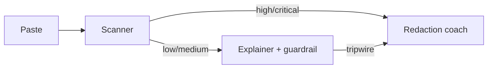

# Safe public paste — multi-agent orchestration

**Problem:** Developers paste logs, stack traces, and HTTP dumps into **public** forums. Those pastes often include **API keys, bearer tokens, emails, and internal IDs**.

**Solution:** A small [OpenAI Agents SDK](https://openai.github.io/openai-agents-python/) pipeline (same orchestration style as `2_openai/deep_research`):

1. **LeakScannerAgent** — structured risk scan (`ScanResult`).
2. **RedactionCoachAgent** — if risk is **high** or **critical**, only redaction guidance (no technical “explain” that could amplify secrets).
3. **ErrorExplainerAgent** — if risk is **low** or **medium**, explain the error; the agent has an **`input_guardrail`** (regex fast path + tiny classifier) as a second line of defense.

## Flow



## Setup

```bash
cd /path/to/agents   # repo root with .venv recommended
source .venv/bin/activate
export OPENAI_API_KEY=sk-...
```

Or load a `.env` from the repo root (`python-dotenv`).

## Run

From this directory (so `import scanner_agent` works):

```bash
python run_demo.py sample_inputs/clean_traceback.txt
python run_demo.py sample_inputs/leaky_log.txt
```

Or open `demo.ipynb` and run all cells.

## Limitations (read this)

- **Educational / best-effort only.** This is **not** enterprise DLP. Models and regex **miss** secrets; false positives happen.
- **Never** paste real production secrets into demos — use fake values like the samples.
- If keys leak, **rotate them**; no tool undoes publication.

## Files

| File | Role |
|------|------|
| `models.py` | Pydantic schemas for structured outputs |
| `scanner_agent.py` | Risk classification |
| `redaction_coach_agent.py` | What to redact + safe example |
| `leak_guardrail.py` | `input_guardrail` before explain |
| `explainer_agent.py` | Diagnosis agent with guardrail attached |
| `orchestrator.py` | `SafePasteManager` + `trace` / `gen_trace_id` |

## Traces

Runs emit a link to the OpenAI trace viewer (same idea as Week 2 labs). See [Tracing](https://openai.github.io/openai-agents-python/) in the SDK docs.
