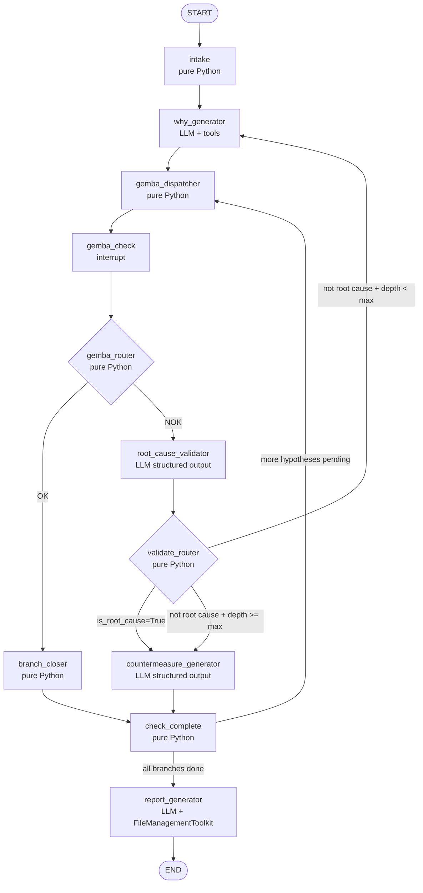

# 5 Whys Agent — Comprehensive Build Plan

## Target Location

All new files go in:

```
4_langgraph/martinsawojide/5whys/
├── models.py               # All Pydantic schemas + TypedDict State
├── five_whys_tools.py      # Tool registry (mirrors sidekick_tools.py)
├── five_whys_agent.py      # FiveWhysAgent class (mirrors sidekick.py)
├── app.py                  # Gradio Blocks UI (mirrors app.py)
├── investigations/         # Sandboxed output dir (mirrors sandbox/)
└── README.md
```

Conventions to match exactly:

- Python `>=3.12`, dependency manager `uv` (no new `requirements.txt` needed — all libs already in `pyproject.toml`)
- `load_dotenv(override=True)` at module level
- Local imports: `from models import ...`, `from five_whys_tools import ...`
- Env vars already present: `OPENAI_API_KEY`, `SERPER_API_KEY`

---

## Graph Architecture



- **LLM nodes** (3): `why_generator`, `root_cause_validator`, `countermeasure_generator`
- **Pure Python nodes** (5): `intake`, `gemba_dispatcher`, `branch_closer`, `check_complete`, `gemba_check` (interrupt only)
- Human pause: `gemba_check` uses `interrupt()` — graph halts, UI shows hypothesis + gemba instructions, resumes on `Command(resume=...)`

---

## Phase 1 — `models.py`: All Schemas

**State design** — `OverallState` (internal) + `InputState` (external-facing):

```python
class WhyNode(TypedDict):
    id: str
    branch_path: str      # e.g. "1.2.1"
    depth: int
    hypothesis: str
    gemba_result: str     # "OK" | "NOK" | "pending"
    gemba_notes: str
    is_root_cause: bool
    countermeasure: str

class OverallState(TypedDict):
    phenomenon: str
    domain_context: str
    why_nodes: Annotated[list[WhyNode], add]        # append reducer
    pending_hypotheses: list[dict]                  # overwrite reducer
    active_hypothesis: dict | None
    current_depth: int
    current_branch_path: str
    max_depth: int
    investigation_id: str
    remaining_steps: RemainingSteps                 # graceful recursion limit
    report_path: str
```

**Structured LLM output schemas** (3 Pydantic BaseModel classes):

- `WhyHypothesisOutput`: `causes: list[str]`, `gemba_instructions: str`, `domain_context: str`
- `RootCauseDecision`: `is_root_cause: bool`, `confidence: float`, `reasoning: str`, `probe_direction: str`
- `CountermeasureOutput`: `action: str`, `prevention_type: str`, `suggested_owner: str`, `deadline_days: int`

---

## Phase 2 — `five_whys_tools.py`: Tool Registry

Single async function `investigation_tools()` returning a list of 4 tools:

- `FileManagementToolkit(root_dir="investigations").get_tools()` — saves reports
- `Tool(name="search_failure_modes", func=GoogleSerperAPIWrapper().run, ...)` — finds known failure patterns
- `WikipediaQueryRun(api_wrapper=WikipediaAPIWrapper())` — technical term lookup
- `PythonREPLTool()` — data/statistics analysis

---

## Phase 3 — `five_whys_agent.py`: Core Agent Class

```python
class FiveWhysAgent:
    async def setup(self, domain: str = "manufacturing",
                    equipment_context: str = "")
    async def build_graph(self)
    def intake(self, state: OverallState) -> dict
    async def why_generator(self, state: OverallState) -> dict  # LLM + tools
    def gemba_dispatcher(self, state: OverallState) -> dict     # pops next hypothesis
    def gemba_check(self, state: OverallState) -> dict          # interrupt()
    def gemba_router(self, state: OverallState) -> str          # "OK" | "NOK"
    def branch_closer(self, state: OverallState) -> dict        # marks OK branch done
    def root_cause_validator(self, state: OverallState) -> dict # evaluator LLM
    def validate_router(self, state: OverallState) -> str       # routing logic
    def countermeasure_generator(self, state: OverallState) -> dict
    def check_complete(self, state: OverallState) -> str        # "dispatch" | "report"
    async def report_generator(self, state: OverallState) -> dict
    async def start_investigation(self, phenomenon: str,
                                   domain: str, investigation_id: str) -> dict
    async def submit_gemba_result(self, investigation_id: str,
                                   result: str, notes: str) -> dict  # Command(resume=...)
    async def get_investigation_tree(self, investigation_id: str) -> list[WhyNode]
    async def cleanup(self)
```

Checkpointer: `SqliteSaver` writing to `investigations/memory.db`.
System prompts enriched with: current datetime, domain, equipment context, instructions for FileManagementToolkit.

---

## Phase 4 — `app.py`: Gradio Blocks UI

Two-column `gr.Blocks` layout:

**Left column** — Setup + Input:

- `gr.Textbox` — phenomenon description
- `gr.Textbox` — domain / equipment context
- `gr.Slider` — max depth (2–7, default 5)
- `gr.Textbox` — investigation ID (auto-generated UUID, editable)
- "Start Investigation" button

**Right column** — Live Investigation:

- `gr.Chatbot` — conversation history (shows hypotheses, validator reasoning, countermeasures)
- `gr.Textbox` — Gemba Check display (current hypothesis + instructions, read-only)
- `gr.Radio` — "OK — stop this branch" / "NOK — go deeper"
- `gr.Textbox` — Gemba notes (what was physically observed)
- "Submit Gemba Result" button
- "Export Report" button → downloads `investigations/<id>.md`

Lifecycle: `ui.load(setup)`, `gr.State(delete_callback=agent.cleanup)`, `launch(inbrowser=True)`.

---

## Phase 5 — `README.md`

- Setup steps (env vars needed: `OPENAI_API_KEY`, `SERPER_API_KEY`)
- How to run: `python app.py` from `4_langgraph/martinsawojide/5whys/`
- Explanation of the Gemba Check flow and `interrupt()` mechanism
- Sample investigation walkthrough

---

## Env Vars Required

All already present in the root `.env`:

- `OPENAI_API_KEY`
- `SERPER_API_KEY`

---

## What Is NOT Included (Deliberate Scope Limits)

- No Playwright browser (not needed — web search via Serper is sufficient)
- No Pushover notifications (not relevant to this domain)
- No parallel `Send` API branching (sequential gemba checks are more practical for one operator; parallel branching is a future enhancement)

---

## Tool Loop in the Current Version

The `why_generator` node uses `bind_tools` (Serper + Wikipedia) before proposing hypotheses. This is **kept in v1** because:

- Domain-specific failure mode search gives hypothesis quality a major lift over pure LLM generation
- It is the exact same `bind_tools` + `ToolNode` pattern from Lab 2 — no additional complexity
- Tools are made **optional**: if `SERPER_API_KEY` is absent, `why_generator` falls back to LLM-only mode

The `root_cause_validator` and `countermeasure_generator` nodes do NOT use tool loops — they use structured output only, keeping evaluation fast and deterministic.

---

## Future Work

### 1. Parallel Branch Exploration (`Send` API)

Replace the sequential `gemba_dispatcher` → single hypothesis loop with the LangGraph `Send` API to fan out all hypotheses at one depth level simultaneously:

```python
# Instead of sequential dispatch, fan out all at once
def why_generator(state: OverallState):
    hypotheses = llm_with_tools.invoke(...)
    return [Send("gemba_check", {**state, "active_hypothesis": h})
            for h in hypotheses.causes]
```

Each branch gets its own independent state slice and runs as a parallel super-step. Requires multiple operators doing simultaneous Gemba Checks (or a single operator handling them sequentially via a queue UI). This is the most impactful scalability upgrade.

### 2. Multimodal Evidence Collection at Gemba Check

Replace the plain text `gemba_notes` field with rich multimodal inputs, enabling the `root_cause_validator` LLM to evaluate actual physical evidence rather than just text descriptions.

| Modality | Use Case | Model / Tool |
|---|---|---|
| **Image / Photo** | Operator photographs the broken part, wear pattern, leak, burn mark | `gpt-4o` vision via `with_structured_output` — passes base64 image in message content |
| **Audio / Voice note** | Operator records a verbal description hands-free on the shop floor | Whisper API (`openai.audio.transcriptions.create`) → text fed to validator |
| **Document / OCR** | Operator photographs a maintenance log, P&ID diagram, or spec sheet | GPT-4o vision or `pytesseract` for OCR → extracted text as tool result |
| **Sensor data / CSV** | Machine telemetry at time of failure | `PythonREPLTool` — LLM writes pandas code to analyse the data, outputs statistics |

Implementation approach — wrap each modality as a LangChain `Tool` called from within `root_cause_validator`'s tool loop:

```python
# Example: image evidence tool
async def analyse_image_evidence(image_path: str) -> str:
    """Analyse a photo taken at the Gemba site."""
    with open(image_path, "rb") as f:
        b64 = base64.b64encode(f.read()).decode()
    response = await vision_llm.ainvoke([
        HumanMessage(content=[
            {"type": "text", "text": "Describe what you see relevant to this failure:"},
            {"type": "image_url", "image_url": {"url": f"data:image/jpeg;base64,{b64}"}}
        ])
    ])
    return response.content
```

This turns the Gemba Check from a text-only step into a full evidence-gathering step where the validator LLM reviews photos, listens to voice notes, and reads documents before making its `RootCauseDecision`.

### 3. Structured Investigation Export Formats

Beyond the current markdown report:

- **PDF export** via `markdown-pdf` or `weasyprint`
- **JSON export** of the full `why_nodes` tree for integration with quality management systems (SAP QM, Jira, etc.)
- **AIAG 8D report template** auto-populated from the investigation state

### 4. Knowledge Base Memory (`InMemoryStore` / `PostgresStore`)

Use LangGraph's cross-thread `Store` to build a searchable library of past investigations. When a new phenomenon is entered, the `why_generator` searches past investigations for similar failure patterns — effectively learning from every investigation.

### 5. Multi-Operator Collaboration

Assign different branches to different operators via a shared `investigation_id` and a role-scoped UI. Each operator sees only their assigned branch's Gemba Checks while the coordinator sees the full tree.
