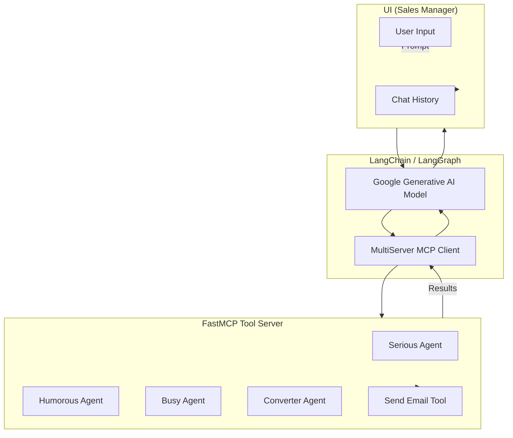

# Sales Agent Email Generator

This project provides an **AI-powered sales email generation system** that allows users to create professional, humorous, or concise cold emails and convert them into HTML for sending via the [Resend API](https://resend.com/).

The system is built on top of:

* [**FastMCP**](https://pypi.org/project/fastmcp/) – for building tool servers
* [**LangChain**](https://www.langchain.com/) + [LangGraph](https://github.com/langchain-ai/langgraph) – for orchestrating AI reasoning
* [**OpenAI SDK**](https://github.com/openai/openai-python) – for LLM-powered agents
* [**Google Generative AI**](https://ai.google.dev/gemini-api) (Gemini 2.5) – for conversation handling
* [**Streamlit**](https://streamlit.io/) – for an interactive chat-based UI
* [**Resend API**](https://resend.com/) – for sending generated emails

---

## 🚀 Scope

This project enables a **Sales Manager** to:

* Generate **cold emails** in different styles:

  * 📧 **Serious** (professional, compliance-focused)
  * 😂 **Humorous** (engaging, witty)
  * ⚡ **Busy** (short, to-the-point)
* Convert plain-text emails to **HTML format**.
* Send emails using **Resend API**.
* Interact via a **Streamlit chat UI** powered by LangChain agents.

---

## 📋 Prerequisites

Before running, ensure you have:

* **Python 3.10+** installed
* A **virtual environment** (recommended)
* The following API keys in your environment (`.env` file):

```bash
OPENAI_API_KEY=your_openai_key_here
GEMINI_API_KEY=your_google_generative_ai_key_here
RESEND_API_KEY=your_resend_api_key_here
MCP_SERVER=http://127.0.0.1:8000
```

---

## ▶️ How to Run

### 1. Start the MCP Tool Server

```bash
uv run mcp_server.py
```

This launches the **Sales Agent Tools Server** at `http://127.0.0.1:8000`.

### 2. Run the Streamlit Frontend

```bash
uv run streamlit run ui_client.py
```

This starts the **Sales Manager UI** where you can chat with the system to generate and send emails.

---

## 💻 Usage

1. Open the **Streamlit app** in your browser.

2. Type a prompt (e.g., *"Write a cold email for a cybersecurity SaaS to a compliance officer."*)

3. The system will:

   * Select the right **sales agent tool**
   * Generate the email draft
   * Optionally **convert to HTML**
   * Send the email (with user approval)

4. Type `clear history` to reset the chat session.

---

## 📊 System Flow Diagram



---

## 📦 Project Structure

```
.
├── mcp_server.py   # MCP server with email generation tools
├── ui_client.py       # Streamlit frontend UI
├── .env              # Environment variables (API keys)
└── README.md         # Project documentation
```

---

## 🔒 Security Notes

* Do **not** commit your `.env` file or API keys.
* Always **verify generated emails** before sending.
* Only use verified sender addresses with Resend API.

---