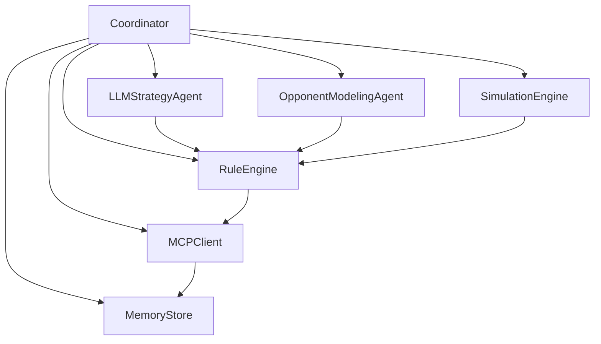

# Allegiance Arena Multi-Agent System

Rebuilt from scratch as a hybrid competitive system for Allegiance Arena:
- LLM-driven reasoning for strategy, negotiation, and opponent interpretation
- deterministic simulation + rule enforcement for final decisions
- MCP-native coordinator loop under strict phase windows

This implementation follows the game spec in `allegiance_arena.pdf`.

## What This Project Includes

### Core modules
- `agent.py` — coordinator that orchestrates phase lifecycle
- `mcp_client.py` — JSON-RPC MCP client (supports streamable HTTP responses)
- `model_router.py` — Groq/OpenRouter routing with fallback and per-component timeouts
- `strategy_llm.py` — LLM strategy planner + diplomacy message generation
- `opponent_model.py` — opponent classifier (`cooperator`, `defector`, `opportunist`, `tit_for_tat`)
- `simulation.py` — expected value + risk estimation (Monte Carlo optional)
- `rule_engine.py` — hard constraints and deterministic final vote validation
- `memory.py` — persistent trust/history/commitment memory
- `models.py` — shared dataclasses
- `config.py` — env-driven configuration
- `main.py` / `__main__.py` — runner entrypoints

### Not included in this rebuilt package
- no Gradio dashboard
- no simulator bot runner

## Architecture



## Execution Flow

1. Register with MCP server.
2. Poll game state continuously.
3. Diplomacy phase:
   - fetch messages
   - update opponent models
   - call LLM planner for ranked targets and message suggestions
   - enforce deterministic message constraints
   - send DMs/broadcast
4. Voting phase:
   - build candidate targets
   - simulate EV/risk for each target
   - apply deterministic rule filters
   - submit final vote
5. Round completion:
   - ingest results/alliances/leaderboard
   - update trust/profiles/history
   - persist memory

## MCP Tools Wrapped

- `register`
- `get_game_state`
- `get_messages`
- `send_message`
- `broadcast`
- `submit_votes`
- `get_round_results`
- `get_agent_history`
- `get_my_history`
- `get_alliances`
- `get_leaderboard`

## Model Routing Defaults

Configured in `.env` and overrideable:
- Strategy/Planning: `llama-3.1-8b-instant` (Groq)
- Opponent Modeling: `openai/gpt-oss-20b` (Groq)
- Messaging: `mistral-7b-instruct` (Groq) -> `gpt-4o-mini` (OpenRouter) fallback
- Realtime backup messaging: `gemma-2-2b`
- Fallback strategy brain: `gpt-4o-mini`

Voting/simulation/rule execution remain deterministic (no LLM).

## Competitive Catch-Up Defaults

This agent now ships with anti-runaway behavior:
- leaderboard payload normalization is enforced before memory write
- fast-start diplomacy burst in early rounds (extra DMs)
- competitive EV penalty for voting current #1 when trailing
- catch-up override in rule engine to prefer strong non-leader alternatives

Tune with:
- `ARENA_FAST_START_ROUNDS`
- `ARENA_FAST_START_EXTRA_DIRECT_MESSAGES`
- `ARENA_AVOID_LEADER_WHEN_BEHIND`
- `ARENA_LEADER_GAP_ACTIVATION`
- `ARENA_LEADER_TARGET_PENALTY_WEIGHT`
- `ARENA_CATCHUP_MIN_EV`

## Setup

From repo root:

```bash
cp allegiance_arena_agent/.env.example allegiance_arena_agent/.env
python -m pip install -r allegiance_arena_agent/requirements.txt
```

Required:
- `ARENA_AGENT_NAME`
- `GROQ_API_KEY`
- `OPENROUTER_API_KEY`

If running local server clone:
- `ARENA_ENDPOINT=http://127.0.0.1:8000/mcp`

## Run

```bash
python allegiance_arena_agent/main.py --env-file allegiance_arena_agent/.env
```

## Logging

State monitor cadence is configurable:
- `ARENA_LOG_GAME_STATE_EVERY_TICKS`
- `ARENA_LOG_GAME_STATE_PAYLOAD`

Example monitor output includes:
- `status`, `round`, `phase`, `players_count`, summarized game-state fields.

## Why This Hybrid Design

- LLM improves adaptation in negotiation and behavioral inference.
- Simulation quantifies expected value before action.
- Deterministic rules prevent invalid/risky final actions.
- Combined pipeline improves competitiveness while remaining stable under adversarial play.
